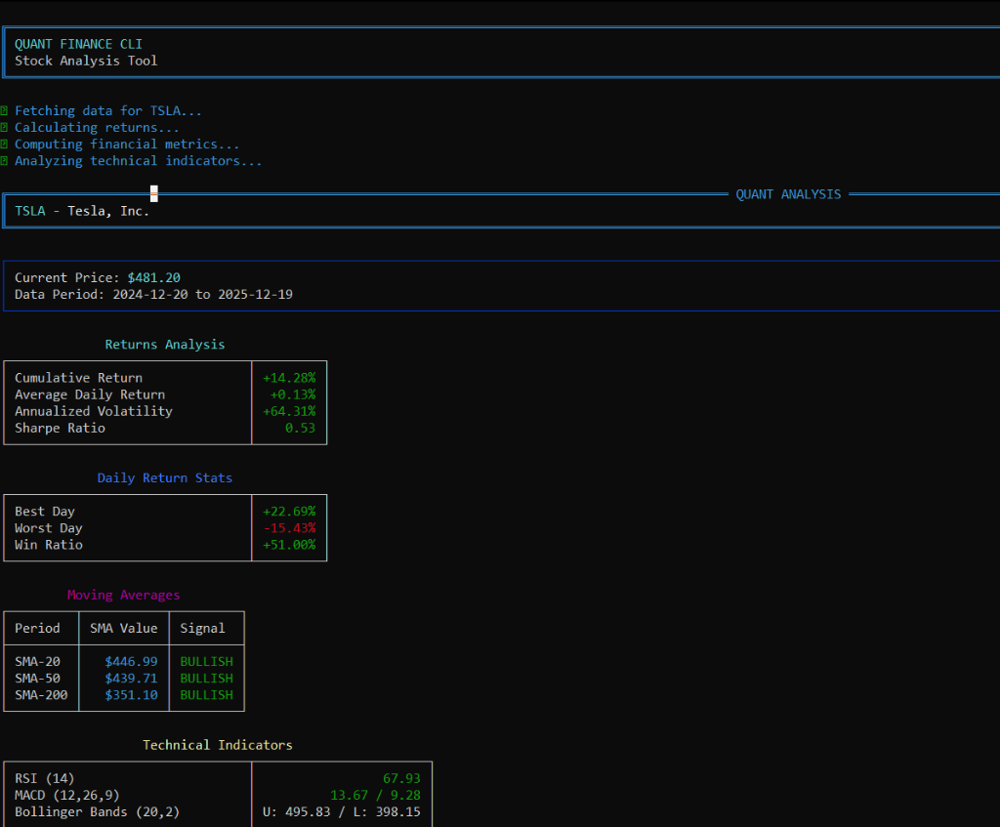

# Quant Finance CLI (QFcli)


**QFcli** is a professional-grade, open-source command-line tool designed for quantitative stock analysis. It bridges the gap between complex financial data and accessible, readable insights. By leveraging real-time data and standard financial models, QFcli provides a comprehensive snapshot of any asset's performance, risk profile, and technical trends.

---

## 🚀 Key Features

### 📊 Core Financial Analysis
*   **Real-time Data**: Fetches the latest OHLCV (Open, High, Low, Close, Volume) data via `yfinance`.
*   **Returns Analysis**: Computes Cumulative Return, Average Daily Return, and Annualized Volatility.
*   **Risk-Adjusted Metrics**: Calculates the **Sharpe Ratio** to evaluate return per unit of risk.
*   **Daily Performance Stats**: Identifying Best Day, Worst Day, and Win Ratio (consistency metric).

### 📈 Technical Indicators (Algo-Trading Ready)
*   **Moving Averages**:
    *   **SMA (Simple Moving Average)**: 20-day (Short-term), 50-day (Medium-term), 200-day (Long-term).
    *   **Trend Signals**: Automatically detects Golden Crosses or Death Crosses logic (Price > SMA = BULLISH).
*   **Momentum & Volatility**:
    *   **RSI (Relative Strength Index)**: 14-period momentum oscillator to spot overbought (>70) or oversold (<30) conditions.
    *   **MACD (Moving Average Convergence Divergence)**: 12, 26, 9 standard setting. Used for trend-following and momentum.
    *   **Bollinger Bands**: 20-period SMA ± 2 standard deviations. Measures volatility squeeze and breakouts.

### 🆚 Advanced Stock Comparison
*   **Head-to-Head**: Compare any two assets (e.g., AAPL vs MSFT, BTC-USD vs ETH-USD).
*   **Winner Determination**: Algorithmic scoring system that evaluates which asset wins on each metric.
*   **Smart Recommendations**: Generates a final investment suggestion based on your risk profile (Growth vs. Stability).

### 🎨 Premium User Experience
*   **Rich UI**: Beautiful terminal output with color-coded panels, tables, and progress bars.
*   **Risk Scoring**: Auto-classifies assets as `HIGH RISK`, `MODERATE`, or `STABLE` based on annualized volatility.

---

## 🛠️ Installation & Setup

### Prerequisites
*   **Python 3.8+**: Ensure you have Python installed (`python --version`).
*   **pip**: Python package manager.

### Step-by-Step Guide

1.  **Clone the Repository**
    ```bash
    git clone https://github.com/MRX-72/QFcli.git
    cd QFcli
    ```

2.  **Create a Virtual Environment (Highly Recommended)**
    A virtual environment keeps your dependencies isolated.
    *   **Windows**:
        ```bash
        python -m venv venv
        .\venv\Scripts\activate
        ```
    *   **macOS / Linux**:
        ```bash
        python3 -m venv venv
        source venv/bin/activate
        ```

3.  **Install Dependencies**
    ```bash
    pip install -r requirements.txt
    ```

---

## 📖 Comprehensive User Guide

### 1. Single Stock Analysis
Get a deep-dive report on a single asset.

**Syntax:** `python main.py [TICKER]`

**Example:**
```bash
python main.py NVDA
```

**Customization Options:**
*   `--period`: Change the lookback period. Default is `1y`.
    *   *Valid Options*: `1d`, `5d`, `1mo`, `3mo`, `6mo`, `1y`, `2y`, `5y`, `10y`, `ytd`, `max`.
    *   *Example*: `python main.py NVDA --period 5y`
*   `--rf`: Set a Risk-Free Rate for Sharpe Ratio (e.g., 10-year Treasury yield). Default is `0.0`.
    *   *Example*: `python main.py SPY --rf 0.045` (implies 4.5% risk-free rate)

### 2. Stock Comparison
Compare two assets to decide which fits your portfolio.

**Syntax:** `python main.py --compare [TICKER1] [TICKER2]`

**Example:**
```bash
python main.py --compare GOOGL META
```

---

## 📸 Example Output

### Single Stock Analysis
Below is an actual output of the tool analyzing Apple Inc. (AAPL):



*(The screenshot above demonstrates the clean, tabulated view of Returns, Daily Stats, Moving Averages, Technicals, and Risk Metrics)*

---

## 🧮 Technical Reference (Formulas & Logic)

For the developers and quants, here is exactly how the metrics are calculated:

### 1. Financial Metrics

| Metric | Formula | Python Implementation |
|--------|---------|-----------------------|
| **Cumulative Return** | $R_{cum} = \frac{P_{end} - P_{start}}{P_{start}}$ | `(prices[-1] - prices[0]) / prices[0]` |
| **Daily Returns** | $r_t = \frac{P_t - P_{t-1}}{P_{t-1}}$ | `prices.pct_change()` |
| **Annualized Volatility** | $\sigma_{ann} = \sigma_{daily} \times \sqrt{252}$ | `returns.std() * np.sqrt(252)` |
| **Sharpe Ratio** | $S = \frac{\bar{r} - r_f}{\sigma}$ | `(returns.mean() - daily_rf) / returns.std() * np.sqrt(252)` |
| **Max Drawdown** | $MDD = \min(\frac{P_t - \max(P_{0..t})}{\max(P_{0..t})})$ | `min(drawdown)` where drawdown is calculated per peak |

### 2. Technical Indicators

| Indicator | Parameters | Formula / Logic |
|-----------|------------|-----------------|
| **SMA** | 20, 50, 200 | Simple average of the last $N$ closing prices. |
| **RSI** | Period: 14 | $RSI = 100 - \frac{100}{1 + RS}$ where $RS = \frac{\text{Avg Gain}}{\text{Avg Loss}}$. |
| **MACD** | 12, 26, 9 | **MACD Line**: $EMA_{12} - EMA_{26}$ <br> **Signal Line**: $EMA_9$ of MACD Line <br> **Histogram**: MACD - Signal |
| **Bollinger Bands** | 20, 2 | **Middle**: $SMA_{20}$ <br> **Upper**: $SMA_{20} + (2 \times \sigma_{20})$ <br> **Lower**: $SMA_{20} - (2 \times \sigma_{20})$ |

### 3. Risk Scoring Logic
The **Risk Score** is determined by Annualized Volatility:
*   🟢 **STABLE**: Volatility < 15%
*   🟡 **MODERATE**: Volatility 15% - 30%
*   🔴 **HIGH RISK**: Volatility > 30%

---

## 📂 Project Structure

```
QFcli/
├── main.py                   # 🏁 Entry Point: Handles args and CLI flow
├── requirements.txt          # 📦 Dependencies list
├── README.md                 # 📄 This documentation
└── quant_finance/            # 🧠 Core Package
    ├── __init__.py           #    - Init file
    ├── data_fetcher.py       #    - yfinance wrapper
    ├── metrics.py            #    - Math: Sharpe, Volatility, Returns
    ├── indicators.py         #    - Technicals: RSI, MACD, SMA, BB
    ├── output.py             #    - UI: Rich tables and panels
    └── comparison.py         #    - Logic: Comparing two stocks
```

---

## 🤝 Contributing

We welcome contributions! Whether you're fixing a bug, adding a new indicator (e.g., Stochastic Oscillator, ATR), or improving documentation:

1.  Fork the repo.
2.  Create a new branch (`git checkout -b feature/amazing-feature`).
3.  Commit your changes.
4.  Push to the branch.
5.  Open a Pull Request.

---

## 📄 License

This project is licensed under the MIT License - see the [LICENSE](LICENSE) file for details.

---

**Made with ❤️ for quantitative finance enthusiasts**
